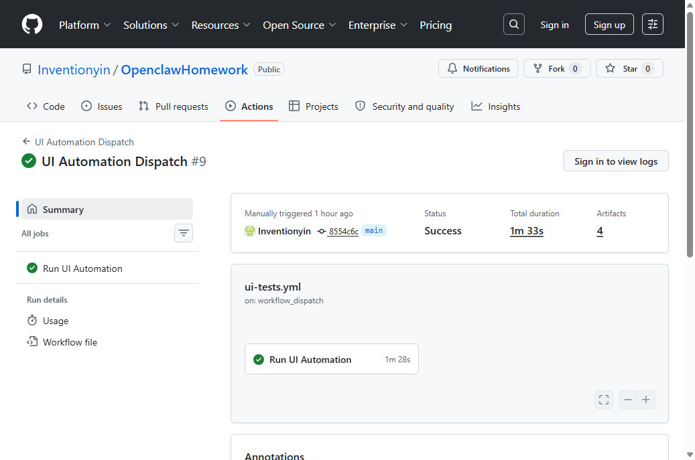
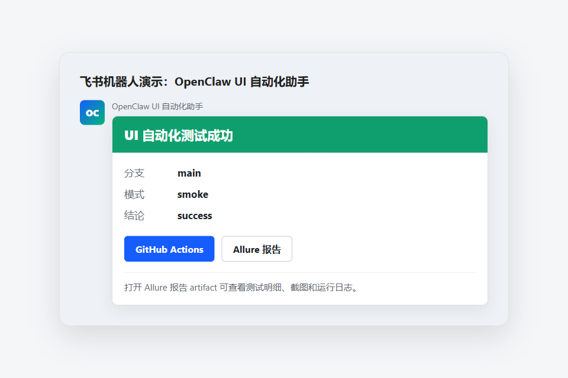

# 最终演示验收

## 1. 已验证的完整链路

```text
飞书消息
  -> https://openclaw.evanshine.me/webhook/feishu
  -> OpenClaw 解析自然语言
  -> GitHub Actions
  -> 启动电商前端
  -> 执行 UI 自动化
  -> 飞书卡片返回结果和报告入口
```

## 2. 推荐演示话术

在飞书里依次发送：

```text
你好
```

```text
帮助
```

```text
绑定我
```

```text
帮我跑一下 main 分支的 UI 自动化冒烟测试
```

## 3. GitHub Actions 成功截图



成功记录：

```text
https://github.com/Inventionyin/OpenclawHomework/actions/runs/25098166593
```

## 4. 飞书结果卡片效果

下面这张图按当前飞书 interactive card 字段生成，用来展示最终返回到飞书里的卡片形态：



飞书里实际可演示的消息：

- `你好`：机器人回复自己是 OpenClaw UI 自动化助手
- `帮助`：机器人回复可用指令
- `绑定我`：把触发权限限制到当前飞书用户
- `帮我跑一下 main 分支的 UI 自动化冒烟测试`：触发 GitHub Actions，并在结束后返回结果卡片

线上服务已启用绑定要求：未发送 `绑定我` 前，测试触发请求会被拒绝；绑定成功后，其他飞书用户不能覆盖这个绑定。

## 5. 当前加分功能

- 飞书消息卡片结果通知
- Allure 报告入口
- 普通聊天和帮助回复
- OpenClaw 自然语言解析
- GitHub Actions 状态轮询
- `绑定我` 用户权限限制
- GitHub Actions 自动启动电商前端并执行 UI 自动化
